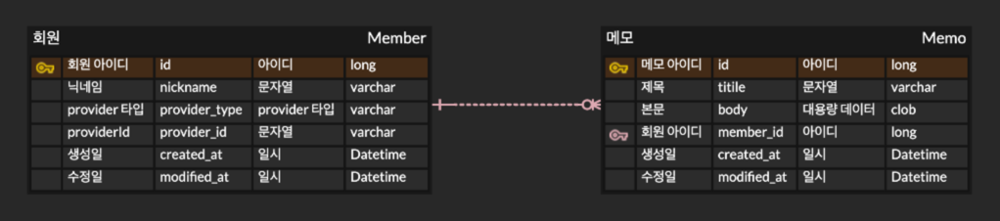

# Memome Backend

온라인 메모 서비스 - 벡엔드

## Key Feature

- 메모를 작성/조회/수정/삭제 할 수 있습니다.
- OAuth2.0/OIDC 기반의 소셜 로그인 지원을 지원합니다.
- JWT 기반 Stateless 인증 구조를 구현하였습니다.

## Tech Stack

## Architecture

### Authentication Architecture

### Deployment Architecture

### ERD

## API Documentation

## Trouble Shooting

- [`permitAll()` 적용 경로에서 JWT 인증 필터가 동작하며 발생한 401 Unauthorized 문제 해결](https://bl0o0g.tistory.com/10)
